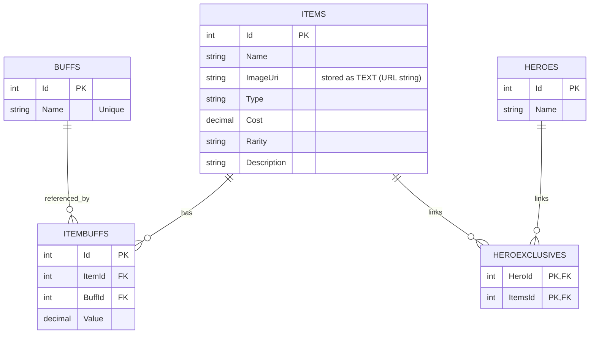

# Data Directory

This directory contains the data generated by the Overwatch Stadium Database Worker.

## Files

### `overwatch_stadium.db`
- **Format**: SQLite Database
- **Description**: The primary database file used by the application. It contains all the crawled data including Heroes, Items, Buffs, and their relationships.
- **Usage**: Can be opened with any SQLite viewer (e.g., DB Browser for SQLite) or used directly by applications supporting SQLite.

### `full_data_dump.sql`
- **Format**: SQL Script
- **Description**: A complete data dump of the database in SQL format.
- **Compatibility**: Designed to be compatible with:
  - SQLite
  - PostgreSQL
  - MySQL (requires `ANSI_QUOTES` mode)
  - Microsoft SQL Server (includes `IDENTITY_INSERT` handling)
- **Usage**: Use this script to import the data into other database systems or for backup purposes.

## Database schema (tables & relationships)

Source of truth: `OverwatchStadiumDatabase/Migrations/20251222075928_Initial.cs`.

> Tip: If you view this README on GitHub, the diagram below renders automatically.

### Table notes

- `Buffs`
  - Columns: `Id` (PK), `Name` (unique index: `IX_Buffs_Name`).
- `Heroes`
  - Columns: `Id` (PK), `Name`.
- `Items`
  - Columns: `Id` (PK), `Name`, `ImageUri`, `Type`, `Cost`, `Rarity`, `Description`.
  - Note: in the C# model `ImageUri` is a `Uri`, but it’s stored as `TEXT` in the database.
- `ItemBuffs`
  - Columns: `Id` (PK), `ItemId` (FK → `Items.Id`), `BuffId` (FK → `Buffs.Id`), `Value`.
  - Purpose: attaches one or more “buff effects” to an item.
- `HeroExclusives`
  - Columns: `HeroId` + `ItemsId` (composite PK; both are FKs).
  - Purpose: many-to-many join table for “hero-exclusive items”. (EF Core shadow join entity `HeroItem`.)

## Generation Process
These files are automatically updated by the GitHub Actions workflow defined in `.github/workflows/update-db.yml`. The worker application crawls the target websites, updates the SQLite database, and then generates the SQL dump script.
